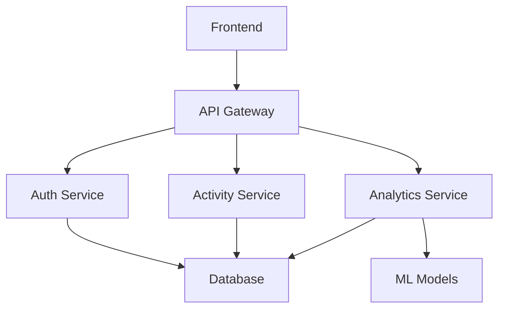

# System Architecture Overview

## High-Level Components

## Data Flow
1. Web/Mobile App → API Gateway
2. API Gateway → Microservices
3. Services → PostgreSQL Database
4. Analytics Service → Redis Cache
5. Scheduled Jobs → S3 Storage

## Technology Stack
- **Frontend**: React.js + Redux
- **API Gateway**: Flask + Gunicorn
- **Database**: PostgreSQL 13
- **Cache**: Redis 6
- **Monitoring**: Prometheus + Grafana
- **Infrastructure**: Docker + Kubernetes

## Scaling Considerations
- Horizontal scaling for stateless services
- Read replicas for database
- Sharding strategy for activity data
- Cache invalidation policies

## Security Architecture
- JWT Authentication
- Role-Based Access Control
- Data Encryption at Rest
- Network Segmentation
- Regular Security Audits
